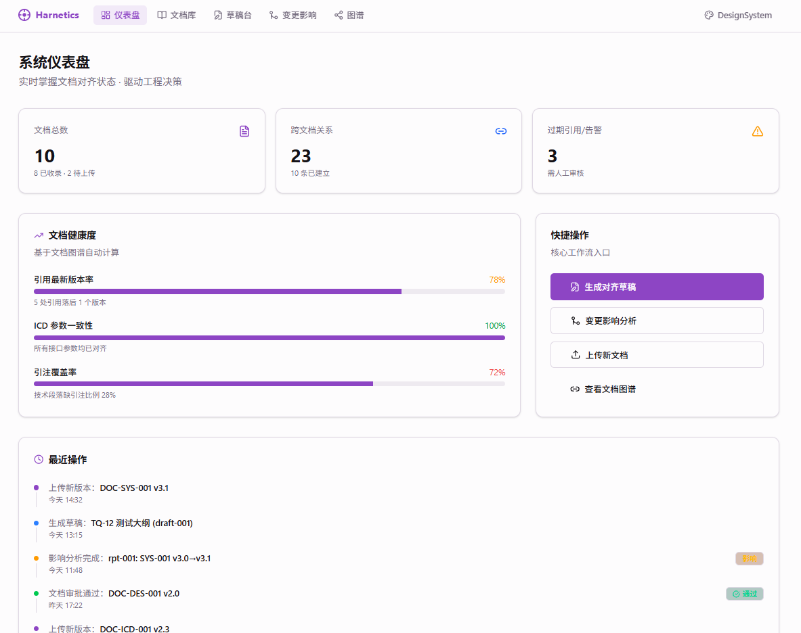
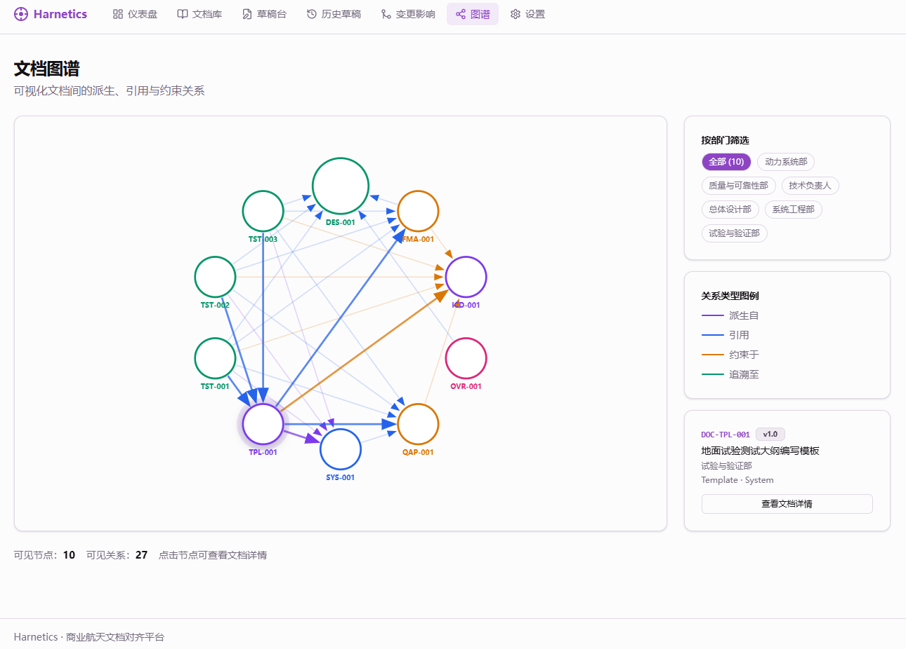
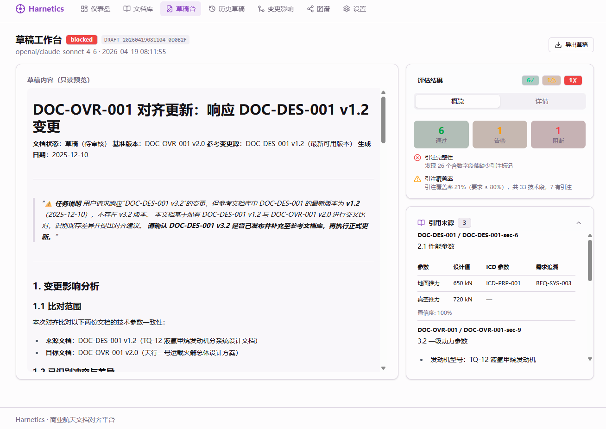

# 🚀Harnetics

[](LICENSE)
[](https://www.python.org/downloads/)
[](https://nodejs.org/)

**商业航天文档对齐工作台** —— 基于文档图谱与大语言模型（LLM），实现跨部门可追溯性、对齐草稿生成与变更影响分析。

航天工程师每天花 40–60% 的时间在文档编写和评审上。最耗时的不是"写"，而是"对齐"——确保一份文档与多部门、多层级的其他文档保持一致。Harnetics 通过文档图谱 + LLM 将这个过程从 2–3 天压缩到半天。

> English documentation: [README_EN.md](README_EN.md)



## 为什么是 Harnetics

商业航天工程团队每天都在为“对齐税”付费：大量时间并不是花在写文档本身，而是花在找上游文档、核对 ICD 参数、确认版本是否一致，以及判断某次改动会波及哪些下游文档。

- **Harnetics 是什么？** 一个面向工程文档对齐的本地优先工作台，把文档导入、关系构图、草稿生成、引注校验和影响分析串成一条可执行闭环。
- **它解决什么具体痛点？** 它把跨部门文档准备从 2–3 天压缩到半天，尤其针对“需求、ICD、设计、测试大纲必须一起对齐”的真实工程场景。
- **为什么它和普通 RAG / 文档助手不一样？** 它不是“对文件聊天”。Harnetics 会构建显式文档关系、校验引注真实性、标记参数冲突，并回答普通 RAG 不会回答的问题：上游文档一变，哪些下游文档和章节必须重审？

## 3 分钟体验



无需配置 Python 或 Node，只需 Docker（[安装方式](https://www.docker.com/products/docker-desktop)）：

```bash
git clone https://github.com/harnetics/harnetics.git
cd harnetics
docker compose up -d
```

打开 `http://localhost:8000`，然后：

1. 进入**设置**页面，填入云端 LLM API Key 和模型名（如 `gpt-4o-mini`）。
2. 进入**文档库** → 点击**上传文档**，从 `fixtures/` 目录导入几个样本文件。
3. 进入**草稿工作台**，为 `TQ-12 液氧甲烷发动机地面热试车测试大纲` 生成一份对齐草稿。
4. 或者打开**变更影响**，查看 ICD 参数变化如何传导到下游文档。

## 核心闭环

先记住这一条主链，而不是记所有模块名：

```text
导入文档
  → 构建文档图谱
    → 生成对齐草稿
      → 评估引注与冲突
        → 分析变更影响
```

- **导入文档**：解析 Markdown/YAML，抽取章节、元数据和 ICD 参数。
- **构建文档图谱**：把需求、ICD、设计、模板和测试文档之间的依赖关系显式存起来。
- **生成对齐草稿**：基于图谱检索拼出 LLM 上下文，输出带真实引注的草稿。
- **评估引注与冲突**：运行 EA/EB/ED 质量门，检查缺失来源、陈旧引用和参数不一致。
- **分析变更影响**：沿下游关系传播，定位哪些文档、哪些章节需要重审。

## Demo 结果预览



**草稿生成示例**

```markdown
### 3.1 额定推力性能试验
验证发动机在额定工况下的地面推力 >= 650 kN，混合比维持 3.5:1。 [📎 DOC-SYS-001 §3.2] [📎 DOC-ICD-001 ICD-PRP-001]

> ⚠ 冲突：DOC-TST-003 仍引用旧版 ICD 中的 600 kN 推力值。
```

**影响分析示例**

```text
变更参数：ICD-PRP-001 地面推力 600 kN -> 650 kN
受影响文档：
- DOC-DES-001  | Critical | §3.1 推力设计点
- DOC-TST-001  | Critical | §3.1 额定推力试验
- DOC-TST-003  | Critical | §2.1 试验参数
- DOC-OVR-001  | Major    | §4.2 动力指标
```

## 能力概览

| 模块                   | 说明                                                                 |
| ---------------------- | -------------------------------------------------------------------- |
| **文档库**       | 上传并浏览 Markdown/YAML/DOCX/XLSX/PDF 文档，自动解析章节与 ICD 参数 |
| **草稿生成**     | LLM 驱动的对齐草稿，含引注回填、冲突检测与质量门评估                 |
| **影响分析**     | BFS 下游变更传播，双模式（AI 向量检索 + 启发式分析）                 |
| **文档图谱**     | 可视化文档间引用、派生、约束关系                                     |
| **仪表盘**       | 文档数量、草稿状态、陈旧引用、LLM 状态概览                           |
| **进化视图**     | GEP 自进化信号历史、策略徽章、标签分布统计                           |
| **校验器实验室** | 一键导入夹具文档并运行 EA/EB/ED 场景，演示自进化信号写入与策略漂移   |

## 第三方引用与致谢

Harnetics 的自进化模块参考并对接了 [EvoMap / Evolver](https://github.com/EvoMap/evolver) 的部分公开设计与工作流，尤其是 **GEP（Genome Evolution Protocol）**、Gene / Capsule / EvolutionEvent 等概念，以及围绕 `evolver` CLI 的本机演化上下文注入方式。在此对 Evolver 项目及其作者表示感谢。

- 上游项目：`EvoMap/evolver`
- 项目地址：<https://github.com/EvoMap/evolver>
- 上游许可证：`GPL-3.0-or-later`（以其仓库当前声明为准）
- Harnetics 中的相关位置：`src/harnetics/engine/evolution/`、Evolution 视图、相关 README / CHANGELOG 说明

更详细的引用边界、说明与后续合规注意事项，请见 [docs/THIRD_PARTY_NOTICES.md](docs/THIRD_PARTY_NOTICES.md)。

## 本地运行

### 环境要求

| 工具    | 版本    | 安装方式                                            |
| ------- | ------- | --------------------------------------------------- |
| Python  | ≥ 3.12 | [python.org](https://www.python.org/downloads/)        |
| uv      | 最新版  | `curl -LsSf https://astral.sh/uv/install.sh \| sh` |
| Node.js | ≥ 22   | [nodejs.org](https://nodejs.org/)                      |
| Rust    | stable  | 仅桌面安装包构建需要，[rustup.rs](https://rustup.rs/) |

### 安装

```bash
git clone https://github.com/harnetics/harnetics.git
cd harnetics
uv sync --dev
cd frontend && npm install && npm run build && cd ..
```

### 配置 LLM 与 Embedding

推荐使用 `.env` 文件统一管理配置，服务启动时自动加载：

```bash
cp .env.example .env
# 用任意编辑器打开 .env，取消注释并填写对应方案的变量
```

**方案 A：云端 OpenAI-compatible**（默认推荐）

```bash
# .env 中填写：
HARNETICS_LLM_MODEL=gpt-4o-mini
HARNETICS_LLM_BASE_URL=
HARNETICS_LLM_API_KEY=sk-...
# 若供应商模型支持 SiliconFlow enable_thinking，可在设置页勾选后发送
# HARNETICS_LLM_THINKING_SUPPORTED=true
# HARNETICS_LLM_ENABLE_THINKING=false

HARNETICS_EMBEDDING_MODEL=text-embedding-3-small
HARNETICS_EMBEDDING_BASE_URL=
HARNETICS_EMBEDDING_API_KEY=sk-...
```

桌面安装包同样默认走云端 LLM 与云端 Embedding。首次启动后也可以在 Web UI 的**设置**页填写 API Key；未填写 Key 时状态页会显示模型不可用，但服务本身仍可启动。

**方案 B：本地 Ollama**（自行部署，离线，无需 API Key）

```bash
# .env 中填写：
HARNETICS_LLM_MODEL=qwen3.5:4b
HARNETICS_LLM_BASE_URL=http://localhost:11434
# HARNETICS_LLM_API_KEY 留空

HARNETICS_EMBEDDING_MODEL=nomic-embed-text
HARNETICS_EMBEDDING_BASE_URL=http://localhost:11434
# HARNETICS_EMBEDDING_API_KEY 留空
```

在本机安装并启动 Ollama（[ollama.com](https://ollama.com)），然后拉取所需模型：

```bash
ollama pull qwen3.5:4b
ollama pull nomic-embed-text
```

> **提示**：也可以在启动服务后，进入 Web UI 的**设置**页面实时填写并保存 LLM / Embedding 配置和高级推理边界，无需重启服务。完整配置项见 [.env.example](.env.example)。

比对审查遇到模型响应慢、供应商输出限制或大文件卡顿时，可在设置页的“高级 / 开发者配置”调整推理边界，也可以直接改 `.env`：

```bash
HARNETICS_LLM_TIMEOUT_SECONDS=180
HARNETICS_LLM_MAX_TOKENS=16384
HARNETICS_COMPARISON_STEP1_MAX_TOKENS=8192
HARNETICS_COMPARISON_4STEP_BATCH_SIZE=10
HARNETICS_COMPARISON_STEP3_MAX_TOKENS=16384
HARNETICS_COMPARISON_STEP4_MAX_TOKENS=4096
```

### 初始化并启动

```bash
# 导入样本航天文档，初始化图谱数据库
uv run python -m harnetics.cli.main init --reset
uv run python -m harnetics.cli.main ingest fixtures/samples/

# 启动服务（自动打开浏览器，Ctrl+C 退出）
uv run python -m harnetics.cli.main serve
```

浏览器将自动打开 `http://localhost:8000`，即可看到加载了样本文档的仪表盘。

前端热更新开发模式（开发时使用，不自动打开浏览器）：

```bash
cd frontend && npm run dev    # → http://localhost:5173
```

### 桌面安装包构建

桌面版复用同一套 React 工作台和 FastAPI 后端：Tauri 负责窗口与进程生命周期，PyInstaller 将后端打成 sidecar。首次桌面构建前先安装 Rust stable。

```bash
# 1. 构建前端静态资源
cd frontend
npm ci
npm run build
cd ..

# 2. 构建 Python 后端 sidecar
uv sync --dev
uv run pyinstaller desktop/pyinstaller/harnetics-server.spec --noconfirm --clean
mkdir -p desktop/src-tauri/binaries

# macOS Apple Silicon 示例；其他平台后缀见 desktop-release CI matrix
cp dist/harnetics-server desktop/src-tauri/binaries/harnetics-server-aarch64-apple-darwin
chmod +x desktop/src-tauri/binaries/harnetics-server-aarch64-apple-darwin

# 3. 构建当前平台桌面包
cd desktop
npm ci
npm run build
```

Windows/macOS 发布包由 `.github/workflows/desktop-release.yml` 在 `v*.*.*` 标签或手动触发时自动构建；手动触发需要填写已有 `release_tag` 才会把产物挂到 GitHub Release。正式公开分发前仍需补充平台签名与 macOS notarization。

### 冒烟测试

```bash
curl http://localhost:8000/health
curl http://localhost:8000/api/dashboard/stats
curl http://localhost:8000/api/documents
```

## 系统架构

```
文档入库 (Markdown/YAML)
  → 解析 & 图谱索引 (SQLite + ChromaDB)
    → LLM 草稿生成 (OpenAI-compatible)
      → 质量门评估 (EA/EB/ED)
        → 影响分析 (BFS + 向量检索)
          → API / React SPA
```

- **后端**：Python 3.12+ · FastAPI · SQLite · ChromaDB · OpenAI SDK
- **前端**：React 18 · TypeScript 5.7 · Vite 6 · Tailwind CSS v4 · shadcn/ui
- **LLM**：OpenAI-compatible 路由，显式支持本地 Ollama 回退
- **设计理念**：本地优先——所有数据默认留存在本机

## API 路由

| 路由                            | 说明                               |
| ------------------------------- | ---------------------------------- |
| `GET /health`                 | 健康检查                           |
| `GET /api/dashboard/stats`    | 仪表盘统计数据                     |
| `GET /api/documents`          | 文档列表                           |
| `GET /api/documents/{doc_id}` | 文档详情（含章节）                 |
| `POST /api/draft/generate`    | 生成对齐草稿                       |
| `GET /api/draft/{draft_id}`   | 查看草稿与引注                     |
| `POST /api/impact/analyze`    | 触发影响分析                       |
| `GET /api/impact`             | 影响分析报告列表                   |
| `GET /api/impact/{report_id}` | 影响分析报告详情                   |
| `GET /api/graph/edges`        | 原始图谱边数据                     |
| `GET /api/status`             | LLM/Embedding 配置状态             |
| `GET /api/settings`           | 当前运行时配置（Key 脱敏）         |
| `PUT /api/settings`           | 更新运行时 LLM/Embedding 配置      |
| `POST /api/documents/upload`  | 上传并导入文档                     |
| `POST /api/fixture/import`    | 导入夹具目录中的源文档到图谱       |
| `GET /api/fixture/scenarios`  | 列举可运行的夹具测试场景           |
| `POST /api/fixture/run`       | 运行单个夹具场景，写入进化信号     |
| `POST /api/fixture/run-all`   | 批量运行所有夹具场景，返回汇总结果 |
| `GET /api/evolution/stats`    | GEP 自进化统计（策略 / 信号历史）  |

## 测试

```bash
# 后端测试
uv run pytest tests/ -q

# 前端构建验证
cd frontend && npm run build

# 桌面运行时路径测试
uv run pytest tests/test_desktop_runtime.py -q
```

## Docker

### 云端部署（推荐）

```bash
docker compose up -d
# → http://localhost:8000
```

服务启动后默认无 LLM 配置 — 打开浏览器中的**设置**页面，填入 `HARNETICS_LLM_API_KEY`、模型名（如 `gpt-4o-mini`）和 API 地址，保存后即生效。也可以在 `docker compose up` 前创建 `.env` 文件（参考 [.env.example](.env.example)）预置配置。

### 本地模型部署（Ollama）

```bash
docker compose -f docker-compose-local.yml up -d
docker exec ollama ollama pull qwen3.5:4b
docker exec ollama ollama pull nomic-embed-text
# → http://localhost:8000 — 已预配置使用本地 Ollama
```

### Qwen3.5 本地模型参考

| 模型                       | 参数量 | 本地硬件显存建议 | Ollama 名称      | 适合机器                        |
| -------------------------- | ------ | ---------------- | ---------------- | ------------------------------- |
| Qwen3.5 0.8B               | 0.8B   | 2–4 GB          | `qwen3.5:0.8b` | 轻薄本、CPU                     |
| Qwen3.5 2B                 | 2B     | 4–6 GB          | `qwen3.5:2b`   | 普通笔记本                      |
| Qwen3.5 4B                 | 4B     | 6–8 GB          | `qwen3.5:4b`   | 入门独显 / Apple Silicon 入门机 |
| Qwen3.5 9B*(latest)*     | 9B     | 10–14 GB        | `qwen3.5:9b`   | RTX 3060/4060、24GB Mac         |
| Qwen3.5 27B                | 27B    | 22–28 GB        | `qwen3.5:27b`  | 24GB+ 显存 / 48–64GB Mac       |
| Qwen3.5 35B-A3B*(MoE)*   | 35B    | 24–32 GB        | `qwen3.5:35b`  | 32GB+ 高显存卡                  |
| Qwen3.5 122B-A10B*(MoE)* | 122B   | 90–120 GB       | `qwen3.5:122b` | 多卡工作站 / 服务器             |

## 项目结构

```
harnetics/
├── docs/                  # 公开项目文档 + 部分本地说明
│   ├── ARCHITECTURE.md    # 对外公开的架构总览
│   ├── CHANGELOG.md       # 版本历史
│   ├── CODE_OF_CONDUCT.md # 社区行为准则
│   └── CONTRIBUTING.md    # 贡献流程说明
├── src/harnetics/         # Python 后端
│   ├── api/               #   FastAPI 应用工厂 + 路由 + SPA 托管
│   │   └── routes/        #     documents / draft / impact / graph / status / evaluate
│   ├── cli/               #   typer CLI（init / ingest / serve）
│   ├── engine/            #   草稿生成、冲突检测、影响分析核心引擎
│   ├── evaluators/        #   质量门评估器（EA/EB/ED）
│   ├── graph/             #   SQLite 图谱存储 + ChromaDB 向量索引
│   ├── llm/               #   OpenAI-compatible 客户端、路由归一化、诊断
│   ├── models/            #   领域 dataclass（document / icd / draft / impact）
│   ├── parsers/           #   Markdown / YAML / ICD 解析器
│   └── config.py          #   Settings + .env 加载器
├── frontend/              # React 18 SPA
│   └── src/
│       ├── pages/         #   路由页面
│       ├── components/    #   共享 UI 组件
│       ├── lib/           #   API 客户端 + 工具函数
│       └── types/         #   TypeScript 领域类型
├── fixtures/              # 航天领域样本文档
├── tests/                 # pytest 测试套件
├── AGENTS.md              # 仓库总地图与工程协议
├── README.md              # 中文优先公开 README
├── README_EN.md           # 英文公开 README
├── README_zh.md           # 中文兼容跳转说明
└── var/                   # 运行时数据（SQLite、ChromaDB）— 已 gitignore
```

## 文档导航

| 文档                                            | 说明                       |
| ----------------------------------------------- | -------------------------- |
| [docs/ARCHITECTURE.md](docs/ARCHITECTURE.md)       | 系统结构、数据流、模块边界 |
| [docs/CONTRIBUTING.md](docs/CONTRIBUTING.md)       | 贡献指南                   |
| [docs/CHANGELOG.md](docs/CHANGELOG.md)             | 版本发布历史               |
| [docs/CODE_OF_CONDUCT.md](docs/CODE_OF_CONDUCT.md) | 社区行为准则               |
| [README.md](README.md)                             | 中文优先公开 README        |
| [README_EN.md](README_EN.md)                       | 英文公开 README            |
| [README_zh.md](README_zh.md)                       | 中文兼容跳转说明           |
| [.env.example](.env.example)                       | 环境变量配置参考           |

## 路线图

| 阶段                     | 重点         | 计划内容                                                                                          |
| ------------------------ | ------------ | ------------------------------------------------------------------------------------------------- |
| **当前（MVP）**    | 核心对齐闭环 | Markdown/YAML 入库、文档图谱、带引注草稿生成、变更影响分析、Evaluator 质量门、React 工作台        |
| **下一阶段（P1）** | 扩展文档接入 | 增加 Word、PDF、Excel 解析器；强化 ICD 表格抽取；加入基于文件监听的自动重索引                     |
| **下一阶段（P1）** | 人类治理增强 | 增加审核队列、AI 边人工确认流程、陈旧引用修复提示、冲突显式标记                                   |
| **后续阶段（P2）** | 规模化与协作 | 从 SQLite 主路径演进到 PostgreSQL-ready 架构，引入更完整的审计/历史视图、团队评审流和实时协作端点 |
| **后续阶段（P2）** | 领域深度     | 扩展 CAD 元数据接入、强化历史知识复用检索、增强跨部门追溯分析能力                                 |

## 贡献：从哪里开始

- **文档解析器** 很适合作为第一类贡献点，尤其是 Word/PDF/Excel 接入。
- **Evaluator** 是天然可扩展层，欢迎补充版本新鲜度、参数一致性和审查策略相关规则。
- **graph/query API** 属于语义边界，涉及查询契约或追溯逻辑的变更请先讨论再动手。
- **frontend / fixtures / docs** 也都欢迎贡献，尤其适合做体验优化、demo 强化和领域语料完善。

## 社区

- 💬 [Discussions](https://github.com/harnetics/harnetics/discussions) —— 交流问题、产品方向与路线图
- 🐛 [Issues](https://github.com/harnetics/harnetics/issues) —— 提交 Bug 与功能建议
- 📖 [贡献指南](docs/CONTRIBUTING.md) —— 查看贡献流程与开发约定

## 贡献

欢迎贡献！请阅读 [docs/CONTRIBUTING.md](docs/CONTRIBUTING.md) 了解：

- 开发环境搭建
- 分支命名与 commit 规范
- Pull Request 流程
- 编码规范

## 许可证

本项目采用 Apache License 2.0 授权——详见 [LICENSE](LICENSE)。
